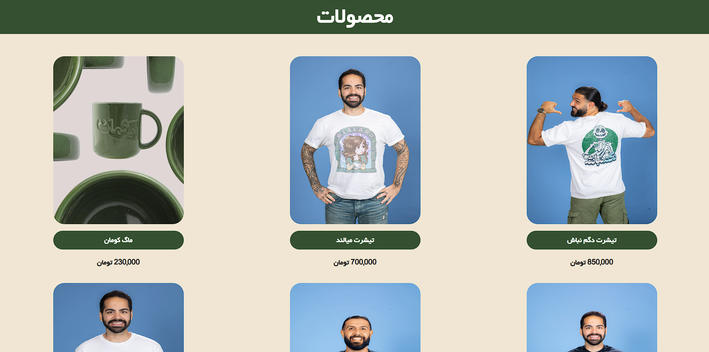
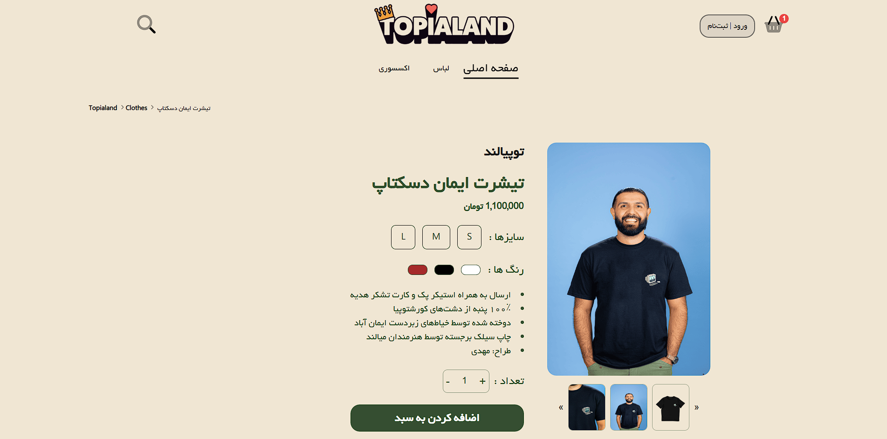
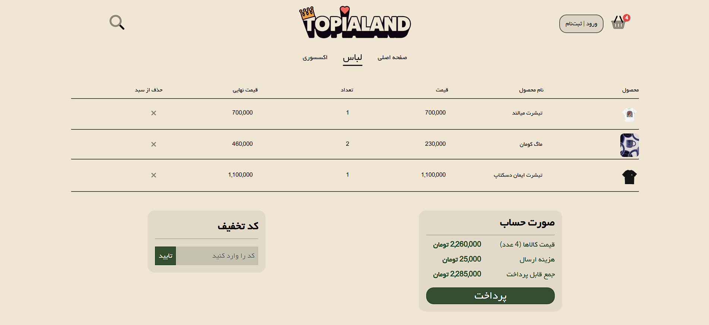

# Project Kouman

## 📌 Overview
**Project Kouman** is a front-end e-commerce–style web application built with **React**, **JavaScript**, **HTML**, and **CSS**. The project uses **React Router** for client-side navigation and was developed using **Vite** for fast development and build performance.

The UI and overall layout were inspired by the real-world website **TOPIALAND.IR**. This project was created strictly for **learning, practice, and portfolio purposes**.

---

## 📸 Preview

<p align="center">
  
  
  
</p>

<p align="center">
  
  
</p>

---

## 🛠️ Tech Stack
- **React (v19)**
- **JavaScript (ES Modules)**
- **HTML5**
- **CSS3**
- **React Router**
- **Vite**
- **ESLint**

---

## ✨ Features
- Multi-page navigation using **React Router**
- Shared **Header** and **Footer** across all pages
- Product listing pages (Clothes & Accessories)
- Dynamic product details using URL parameters
- Login / Signup page UI
- Shopping cart page
- Responsive layout

---

## 🧭 Pages & Routes
The application includes the following routes:

| Route | Description |
|------|------------|
| `/` | Main page with banner |
| `/Clothes` | Clothes products page |
| `/Accessory` | Accessories products page |
| `/product/:productId` | Product details page |
| `/loginsignup` | Login & signup page |
| `/cart` | Shopping cart page |

---

## 📂 Project Structure
```
project-kouman/
│
├── public/
│   └── Fonts, Icons, ...
│
├── src/
│   ├── Components/
│   │   ├── Banners/
│   │   ├── Breadcrumbs/
│   │   ├── Footer/
│   │   ├── Header/
│   │   ├── Items/
│   │   ├── ProductPage/
│   │   └── ProductDisplay/
│   │
│   ├── Pages/
│   │   ├── CSS/
│   │   ├── MainPage.jsx
│   │   ├── Clothes.jsx
│   │   ├── Accessory.jsx
│   │   ├── ProductInfo.jsx
│   │   ├── LoginSignup.jsx
│   │   └── Cart.jsx
│   │
│   ├── App.jsx
│   ├── html.css
│   └── main.jsx
│
├── package.json
├── index.html
└── README.md
```

---

## 🌐 Live Demo
[Visit Site](https://erfankhadiv.github.io/Kouman/)

---

## 🎯 Purpose of the Project
- Practice building real-world React applications
- Learn React Router and component-based architecture
- Improve front-end UI/UX skills
- Create a portfolio-ready project

---

## ⚠️ Disclaimer
This project is **not affiliated with or endorsed by TOPIALAND.IR**. All design inspiration was used only for educational purposes. No backend services, proprietary data, or private APIs were used.

---

## 📝 License
This project is licensed under the MIT License.  
See the LICENSE file for details.

---

## 👤 Author
**Erfan Khadiv** 

GitHub: https://github.com/ErfanKhadiv

---

## ⭐ Acknowledgements
- Inspiration: **TOPIALAND.IR**
- React & Vite Documentation
- Open-source community
